> **NOTE**  
> 要下载Edge浏览器

## 大致流程

[**抢票准备**](#div-id1-抢票准备div): 进入选项1 来设置抢那些票

[**开始抢票**](#div-id2-开始抢票div): 进入选项2 开开始你得抢票

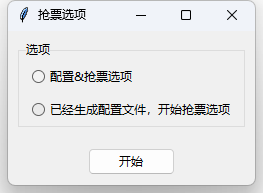

## 
抢票准备

### 进入输入界面

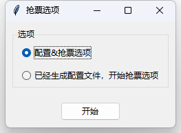

### 填入想要抢的票ID

> **NOTE**  
> 填完后 可能会自动打开浏览器, 这时候, 在浏览器里面登录, 登录完成会自动关闭 (**电脑里面要有Edge浏览器才可以**)
>
> 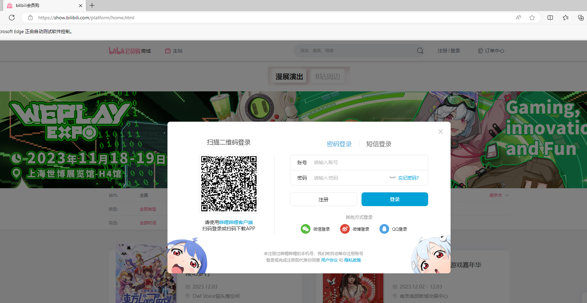
>
>

填入即可

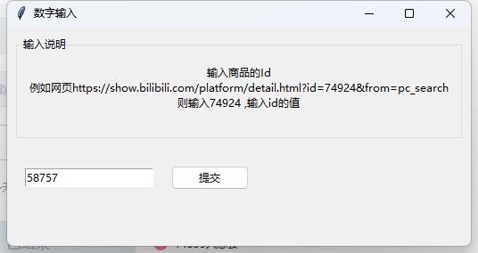

### 如何找到ID?

去看网页URL里面`id=`后面那个数字就是的
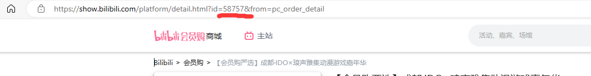

### 选票阶段

**选择票, 填入要买的数量即可**

> **NOTE**  
> 红色是无法购买的票 (没票了? 时间没到? 反正没法买)
>
> 绿色是能够买的票

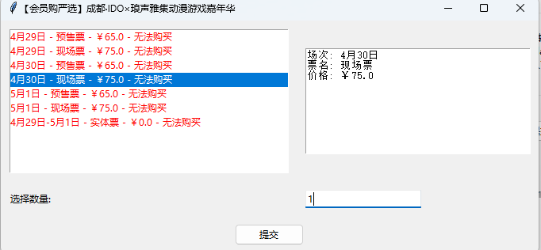

#### 为什么我居然可以选择我没有发售的票?????

这个界面**不是**抢票界面, 他是抢票的准备界面, 你可以填入你想抢的票的所有的信息,程序处理你得信息,生成用于抢票的配置信息,
然后在接下来的[抢票阶段](#div-id2-开始抢票div), 你可以在票发售的第一时间不需要输入任何信息就可以直接开始抢票

### 选人阶段

**选择你的购买人信息, 点名字就好,点了变成蓝色,就表示选中**

**显然, 如果你选2张票, 那你必须选2个人**

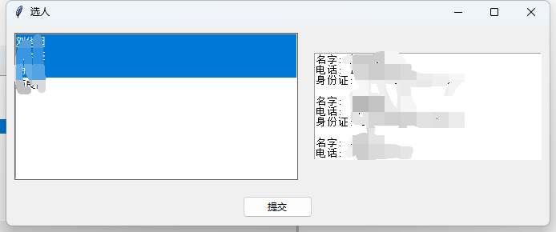

#### 我买的票是不需要实名的,为什么要填入实名????

以防万一, 在不知道是否需要实名的情况下, 先准备一下

### 配置信息复制

**所做的一切就是为了配置信息, 现在得到了,那就保存他(点按钮复制即可)**

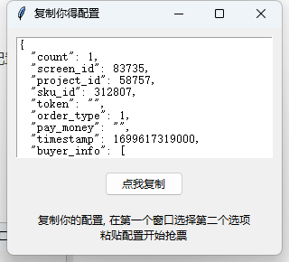

## 
开始抢票

### 选择界面

**选第二个**

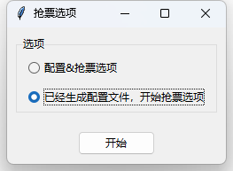

### 配置抢票

**界面介绍**

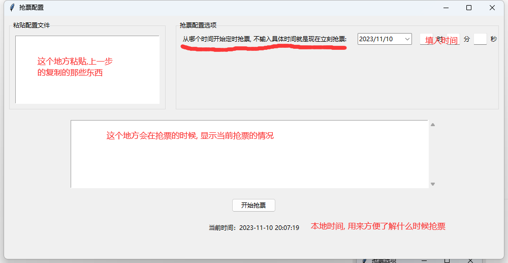

**具体流程**

> **NOTE**  
> 这边建议, 拿一些商品练练手, 抢几个就熟悉了

**填入配置, 设定时间之后, 就会显示距离多久开始抢票**

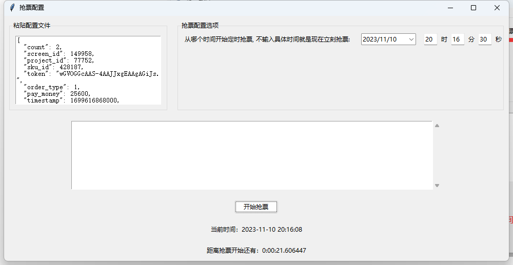

**然后到点就开始抢票**

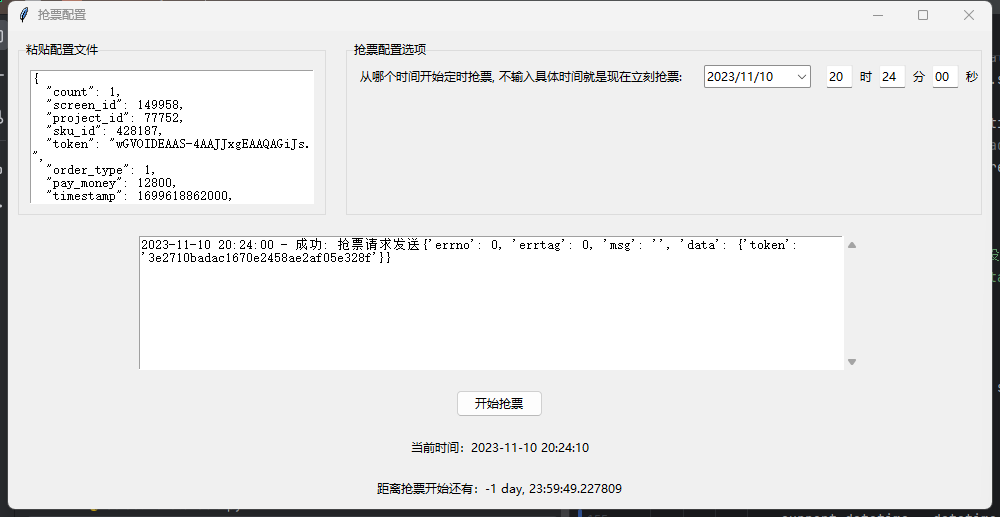

**去订单中心那里下单即可**

#### 你需要注意什么?

1. 当前时间可能和b站0服务器时间有微小差别
2. 你可以不填入时间, 这就代表立刻抢票
3. 注意上面那个图, 如果你抢票成功,屏幕上面会显示和上图格式差不多的信息, 如果你看到那个信息,那就可以去下单了0
4. 程序会帮你发送抢票请求, 具体是否成功,参考下面公式

$$
正确的抢票时间 + 正确的配置 + 确实有票 = 抢到票
$$

#### 为什么还要去b站下单?

订单拿下来, 只要付钱了这票就是你的了

